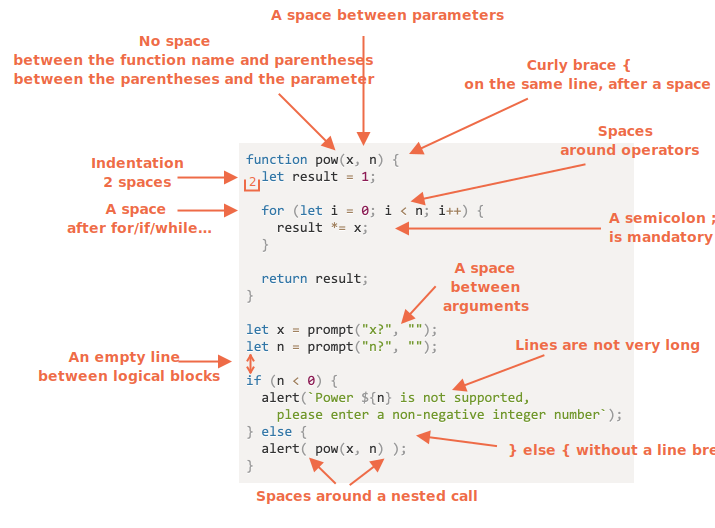

# কোডিং স্টাইল

আমাদের কোড যতটুকু সম্ভব পড়ার জন্য পরিচ্ছন্ন ও সহজ রাখতে হবে।

একটি জটিল কাজ নিয়ে এমনভাবে কোড করা যা একাধারে সঠিক ও মানুষের জন্য পাঠযোগ্য -- এটাই প্রোগ্রামিংয়ের আর্ট । একটি ভালো কোডিং স্টাইল এতে অনেকটাই সহযোগিতা করে । 

## শব্দবিন্যাস ( সিনট্যাক্স )

এখানে কিছু সাজেশন দেয়া হল (বিস্তারিত নিচে দেয়া দেখুন):


<!--
```js
function pow(x, n) {
  let result = 1;

  for (let i = 0; i < n; i++) {
    result *= x;
  }

  return result;
}

let x = prompt("x?", "");
let n = prompt("n?", "");

if (n < 0) {
  alert(`Power ${n} is not supported,
    please enter a non-negative integer number`);
} else {
  alert( pow(x, n) );
}
```

-->

এখন চলুন কিছু নিয়ম ও তার কারণ সম্বন্ধে জেনে নেইঃ

```warn header="There are no \"you must\" rules"
এখনে পাথরে খোদাই করে লিছু বলা নেই। এগুলো কোডিং স্টাইলের পছন্দ মাত্র, কোন ধর্মীয় মতবাদ নয়।
```

### দ্বিতীয় বন্ধনী

বেশিরভাগ জাভাস্ক্রিপ্ট প্রজেক্টেই দ্বিতীয় বন্ধনীগুলোকে "মিশরীয়" কায়দায় লেখা হয় যাতে শুরুর বন্ধনীটি অনুরূপ কিওয়ার্ডের সাথে একই লাইনে থাকে -- নতুন লাইনে নয়। তবে শুরুর বন্ধনীটি আগে একটি ফাঁকা স্পেস থাকা উচিৎ।
কিছুটা এমন ঃ 

```js
if (condition) {
  // কিছু কোড
  // ...আরও কিছু কোড
  // ...আরও কিছু কোড
}
```

একটি একলাইনের কনস্ট্রাকটর, যেমন `if (condition) doSomething()`, একটি গুরুত্বপূর্ণ কেইস। এখানে কি বন্ধনী দেয়া উচিৎ ?

এখানে বিভিন্ন টীকা যুক্ত করা হলো যাতে আপনি নিজেই পঠনযোগ্যতা যাচাই করতে পারেনঃ

1. 😠অনভিজ্ঞরা প্রায়ই এটা করে। বাজে! এখানে ২য় বন্ধনির দরকার নেই:
    ```js
    if (n < 0) *!*{*/!*alert(`Power ${n} is not supported`);*!*}*/!*
    ```
2. 😠 দ্বিতীয় বন্ধনী ছাড়াই নতুন লাইনে চলে যাওয়া। কখনই এটা করবেন না, নতুন লাইন করতে গেলে ভুলের সম্বাবনা বেড়ে যায়:
    ```js
    if (n < 0)
      alert(`Power ${n} is not supported`);
    ```
3. 😏 দ্বিতীয় বন্ধনী ছাড়াই একলাইনের কোড - কোড ছোট হলে, গ্রহণযোগ্য:
    ```js
    if (n < 0) alert(`Power ${n} is not supported`);
    ```
4. 😃 সবচেয়ে ভালো পন্থা:
    ```js
    if (n < 0) {
      alert(`Power ${n} is not supported`);
    }
    ```

সংক্ষিপ্ত কোডের জন্য একলাইনে লিখা গ্রহণযোগ্য, যথাঃ `if (cond) return null`. কিন্তু একটা কোড ব্লক (সবশেষে যেটা দেখলাম) সাধারণত বেশী পাঠযোগ্য।

### লাইনের দৈর্ঘ্য

কেউই লম্বা অনুভূমিক লাইন পড়তে পছন্দ করে না। একে ভাগ করে দেয়াই উত্তম।

উদাহারণস্বরুপ:
```js
// ব্যাকটিক কোট ` এর সাহায্যে একটা স্ট্রিংকে ভাগ করা যায়
let str = `
  ECMA International's TC39 is a group of JavaScript developers,
  implementers, academics, and more, collaborating with the community
  to maintain and evolve the definition of JavaScript.
`;
```

এবং  `if` স্টেট্মেন্টগুলোয় :

```js
if (
  id === 123 &&
  moonPhase === 'Waning Gibbous' &&
  zodiacSign === 'Libra'
) {
  letTheSorceryBegin();
}
```

লাইনের দৈর্ঘ্য নিজেদের টিমের সাথে অলোচনা করে নেয়া উচিৎ। সাধারণত এটা ৮০ থেকে ১২০ অক্ষরের হয়।

### ইন্ডেন্ট (খাঁজ)

ইন্ডেন্ট ২ ধরণের হয়:

- **আনুভুমিক ইন্ডেন্ট: ২ অথবা ৪ টি স্পেস**

    একটি আনুভুমিক ইন্ডেন্ট ২ থেকে ৪ টি স্পেস নিয়ে গঠিত অথবা আনুভুমিক ট্যাব চিহ্ন (কী `key:Tab`)। কোনটা ভাল একটি বিতর্কের বিষয়। যদিও স্পেসের ব্যাবহার এখন বেশি।

    ইন্ডেন্টশনের ক্ষেত্রে ট্যাব চিহ্ন থেকে স্পেস ব্যাবহারের একটি বাড়তি সুবিধা হল এর বেশি ফ্ল্যাক্সিবল কনফিগারেশনের 

<<<<<<< HEAD
    যেমন, এভাবে আমরা আর্গুমেন্টগুলোকে  শুরুর ব্যাকেটের সাথে লম্বভাবে রাখতে পারি :
=======
    For instance, we can align the parameters with the opening bracket, like this:
>>>>>>> 7533c719fbf62ba57188d6d51fe4c038b282bd0c

    ```js no-beautify
    show(parameters,
         aligned, // বামপাশে ৫টি স্পেস দেয়া
         one,
         after,
         another
      ) {
      // ...
    }
    ```

- **উল্লম্ব ইন্ডেন্ট : কোডকে লজিকাল ব্লকে ভাগ করতে ফাঁকা লাইন**

    এমনকি শুধুমাত্র একটা ফাংশনকে কয়েকটি লজিকাল ব্লকে ভাগ করা যেতে পারে। নিচে উদাহারনে, চলক নির্ধারণ করতে, প্রধান লুপ ও তার ফলাফল রিটার্নকে একাধিক উল্লম্ব খণ্ডে ভাগ করা হয়েছে:

    ```js
    function pow(x, n) {
      let result = 1;
      //              <--
      for (let i = 0; i < n; i++) {
        result *= x;
      }
      //              <--
      return result;
    }
    ```

    একটি বাড়তি লাইন এখানে কোডকে আরও পড়ার উপযোগী করেছে। উল্লম্ব ইন্ডেন্ট ছাড়া ৯ লাইনের বেশী কোড থাকা উচিৎ নয়।

### সেমিকোলন

একটি সেমিকোলন থাকা উচিৎ প্রতিটি স্টেট্মেন্টের শেষে, যদিও এটা বাদও দেয়া যায়।

কিছু প্রোগ্রামিং ভাষায় সত্যিই সেমিকোলন মূখ্য নয় এবং কম ব্যাবহার হয়। যদিও জাভাস্ক্রিপ্টে কিছু সময় লাইনের শেষকে সেমিকোলন হিসেবে ধরা হয় না, এটি কোডে পরে এরর করে দিতে পারে। এব্যাপারে আরও জানতেঃ <info:structure#semicolon>.

আপনি জাভাস্ক্রিপ্টে দক্ষ হলে, সেমিকোলন ছাড়া স্টাইল পছন্দ করতে পারেন [StandardJS](https://standardjs.com/). অন্যথায়,ফাঁদে পরতে না চাইলে সেমিকোলন দেয়াই শ্রেয়। বেশিরভাগ ডেভ্লপারই এটি দেয়। 

### নেস্টিং লেভেল

বেশি গভীর নেস্টিং কোড লিখা থেকে বিরত থাকুন।

যথা, লুপে, বাড়তি নেস্টিং বাদ দিতে [`continue`](info:while-for#continue) ডিরেক্টিভ ব্যাবহার করা ভালো

যেমন, নিচের মত একটা নেস্টিং `if` যোগ করা  থেকে:

```js
for (let i = 0; i < 10; i++) {
  if (cond) {
    ... // <- one more nesting level
  }
}
```

আমরা লিখতে পারি:

```js
for (let i = 0; i < 10; i++) {
  if (!cond) *!*continue*/!*;
  ...  // <- no extra nesting level
}
```

একই জিনিস করা যাবে  `if/else` ও `return` এর সাথে

উদাহারণ হিসেবে, নিচে অনুরুপ ২টি কন্সট্রাক্টর

অপশন ১:

```js
function pow(x, n) {
  if (n < 0) {
    alert("Negative 'n' not supported");
  } else {
    let result = 1;

    for (let i = 0; i < n; i++) {
      result *= x;
    }

    return result;
  }  
}
```

অপশন ২:

```js
function pow(x, n) {
  if (n < 0) {
    alert("Negative 'n' not supported");
    return;
  }

  let result = 1;

  for (let i = 0; i < n; i++) {
    result *= x;
  }

  return result;
}
```

২য় টি বেশী পাঠযোগ্য কারণ "বিশেষ কেস" `n < 0` আগেই বিবেচনা করা হচ্ছে, একবার দেখা শেষ হলে আমরা পরের "আসল" কোডে যেতে পারি, কোন বাড়তি নেস্টিং ছাড়াই।

## ফাংশন স্থাননির্ণয়

যদি আমরা একধিক "হেল্পার" ফাংশন লিখি ও কোডে ব্যাবহার করি, ৩টি পন্থা আছে ফাংশনসমূহকে বিন্যস্ত করার।

1. কোডে ব্যাবহারের আগেই ফাংশন "উপরে" নির্ধারণ করুন:

    ```js
    // *!*function declarations*/!*
    function createElement() {
      ...
    }

    function setHandler(elem) {
      ...
    }

    function walkAround() {
      ...
    }

    // *!*the code which uses them*/!*
    let elem = createElement();
    setHandler(elem);
    walkAround();
    ```
2. আগে কোড পরে ফাংশনঃ

    ```js
    // *!*the code which uses the functions*/!*
    let elem = createElement();
    setHandler(elem);
    walkAround();

    // --- *!*helper functions*/!* ---
    function createElement() {
      ...
    }

    function setHandler(elem) {
      ...
    }

    function walkAround() {
      ...
    }
    ```
3. মিশ্রণঃ কোডে প্রথমে ব্যাবহারের আগে নির্ধারণ করুন

প্রায়শই ২য় পন্থাটিই ব্যাবহার হয়।

এর কারন যখন এটি পড়া হয়, আমরা আগে থেকে জানতে চাই *এটি কি করে*। আগে কোড করলে, শুরু থেকেই এটা বুঝা যায়। তখন হয়ত, আমরা আর ফাংশন পড়ার দরকারও হয় না। বিশেষত, যদি ফাংশ্নের নাম তার কাজ সম্পর্কে যথেষ্ট বিস্তারিত হয়।

## স্টাইল গাইড 

স্টাইল গাইড "কিভাবে কোড লিখতে হয়" এমন রীতি নিয়ে গঠিত, যেমনঃ কোন কোট ব্যাবহার করতে হবে, কতগুলি স্পেসে ইন্ডেন্ট, সর্বোচ্চ লাইন লেন্থ, ইত্যাদি সহ অনেক গৌণ বিষয়।

যখন একটি টিমের সবাই একই গাইড মেনে চলে, তা যতজন সদস্যাই লিখুক না কেন, কোড অভিন্ন মনে হয়।

অবশ্যই একটা টীম নিজের মত গাইড লিখতে পারে,কিন্তু তার তেমন দরকার নেই। অনেক গাইড আছে বেছে নেয়ার জন্য।

কিছু জনপ্রিয় নীতি:

- [Google JavaScript Style Guide](https://google.github.io/styleguide/jsguide.html)
- [Airbnb JavaScript Style Guide](https://github.com/airbnb/javascript)
- [Idiomatic.JS](https://github.com/rwaldron/idiomatic.js)
- [StandardJS](https://standardjs.com/)
- (plus many more)

আপনি নতুন ডেভেলপার হলে, অধ্যায়ের আরম্ভে দেয়া সাজেশ্ন থেকে শুরু করতে পারেন। তারপর আপনি এই গাইডগুলো থেকে দেখে নিয়ে একটা পছন্দ করে নিতে পারেন।

## স্বয়ংক্রিয় লিন্টারস

লিন্টারস এমন টুল যা স্বয়ংক্রিয়ভাবে কোড স্টাইল চেক করে সাজেশন দেয়।

মজার ব্যাপার হল স্টাইল চেক অনেক সময় বাগ পেতে সাহায্য করে, যেমন ভ্যারিএবল টাইপ  বা ফাংশনের নাম. এই ফিচারটির জন্য, লিন্টারস ব্যাবহারে উৎসাহ দেয়া হয়, এমনকি যদি আপনি একটি "কোডিং স্টাইলে" আজীবন থাকতে নাও চান।

এখনে কিছু পরিচিত লিন্টারস টুলঃ

- [JSLint](http://www.jslint.com/) -- one of the first linters.
- [JSHint](http://www.jshint.com/) -- more settings than JSLint.
- [ESLint](http://eslint.org/) -- probably the newest one.

সবগুলিই তাদের কাজ ভালো করে। লেখন ব্যাবহার করেঃ [ESLint](http://eslint.org/).

অনেক কোড এডিটরে এটা আগে থেকেই থাকে: শুধুমাত্র প্লাগইন এনেবল করে কোড স্টাইল কনফিগার করলেই হয়।

যেমন ESLint এর জন্য দেখতে পারেনঃ

1. ইন্সটল [Node.js](https://nodejs.org/).
2. ইন্সটল ESLint এই কমান্ড দিয়ে `npm install -g eslint` (npm is a JavaScript package installer).
3. একটি কনফিগ ফাইল বানান `.eslintrc` জাভাস্ক্রিপ্টের রুটে প্রজেক্ট (যে ফোল্ডার সব ফাইল রাখছে).
4. ইন্সটল/এনেবল সেই প্লাগইন যা আপনার এডিটরে ESLint যোগ করবে। সিংহভাগ এডিটরে এটা আছে।

একটি উদাহারণ `.eslintrc` ফাইল:

```js
{
  "extends": "eslint:recommended",
  "env": {
    "browser": true,
    "node": true,
    "es6": true
  },
  "rules": {
    "no-console": 0,
    "indent": 2
  }
}
```

এখানে ডিরেক্টিভ `"extends"` মানে সেটিংসে কনফিগারেশনটির বেস "eslint:recommended" সেট করা. এরপর, আমরা আমাদেরটা নির্দিষ্ট করে দেই।

অয়েব থেকে স্টাইল রুলস ডাউনলোড করে এক্সটেন্ডও করা যায়। আরও জানতে দেখুন <http://eslint.org/docs/user-guide/getting-started> 

এছাড়া কিছু IDE তে লিন্টারস বিল্ট-ইন থাকে,যেটা সুবিধাজনক কিন্তু ESLint মত চাহিদা মত পরিবর্তন করতে পারি না।

## সারসংক্ষেপ 

সব সিনট্যাক্স রুলস বর্ননা করা হয়েছে (স্টাইল গাইডও তুলে ধরা হয়েছে) নিজ থেকেই কোডের পাঠযোগ্যতা বাড়ান। প্রায় সবই বিতর্কিত। 

যখন আমরা আরও "ভালো কোড" লিখার কথা ভাবি, আমাদের নিজেদের জিজ্ঞাসা করা উচিৎ: "কোনটি কোদকে আরও সহজ ও পাঠযোগ্য করে তোলে??" ও "কোনটা আমাদের এরর এড়াতে সাহায্য করবে?" এইদিকগুলো মাথায় রাখতে হবে যখন কোড স্টাইল বেছে নিব ও তার পক্ষে যুক্তি দিবো।

কোডিং স্টাইল গাইড নিয়ে পড়লে আপনি সময়ের সাথে তাল মিলিয়ে, কোডিং স্টাইলের ট্রেন্ড ও সবচেয়ে ভালো অনুশীলন নিয়ে নতুন ধারনাগুলো সম্বন্ধে জানতে পারবেন।