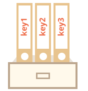
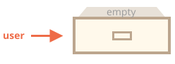
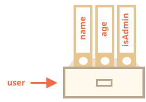
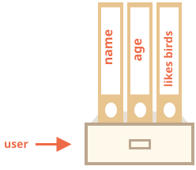
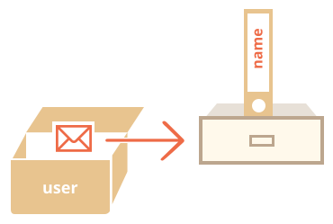
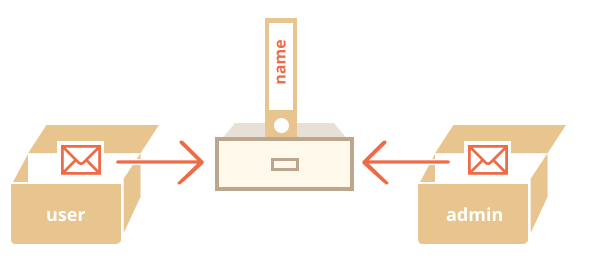

# অবজেক্ট

<info:types> অধ্যায়ে আমরা জেনেছি, জাভাস্ক্রিপ্টে আটটি ডাটা টাইপ রয়েছে। তাদের মধ্যে সাতটিকে বলা হয় "প্রিমিটিভ", কারণ তাদের ভ্যালুতে শুধু একটি জিনিসই (হোক তা স্ট্রিং, নাম্বার বা অন্য যেকোনো কিছু) থেকে থাকে।

অন্যদিকে, বিভিন্ন ধরনের ডাটার কালেকশন ও একটু জটিল ধরনের জিনিস রাখার জন্য অবজেক্ট ব্যবহৃত হয়। জাভাস্ক্রিপ্টের প্রতিটি বিষয়ে অবজেক্টের আধিক্য এবং প্রভাব বিদ্যমান। সুতরাং অন্য কিছু নিয়ে গভীরে জানার আগে আমাদের অবশ্যই অবজেক্ট সম্পর্কে জানতে হবে।

দ্বিতীয় বন্ধনী `{…}` ও তার সাথে একগুচ্ছ ঐচ্ছিক *প্রোপার্টি* এর সাহায্যে একটি অবজেক্ট তৈরি করা যায়। একটি প্রপার্টি "key: value" জোড়ায় হয়ে থাকে, যেখানে `key` একটি স্ট্রিং (একে প্রোপার্টির নামও বলা হয়), এবং `value` হতে পারে যেকোনো কিছু।

আমরা অবজেক্টকে তুলনা করতে পারি একটি সাইন করা ফাইলের কেবিনেটের সাথে। যেখানে প্রতিটি ফাইল একটি key (ফাইলের নাম) দিয়ে সংরক্ষণ করা আছে। সুতরাং ফাইলের নাম দিয়ে ফাইল খুঁজে বের করা বা নতুন ফাইল যুক্ত করা অথবা মুছে ফেলা খুবই সহজ।



একটি খালি অবজেক্ট ("খালি কেবিনেট"), এ দুটি সিনট্যাক্সের যেকোনো একটি দিয়ে তৈরি করা যায়ঃ

```js
let user = new Object(); // "অবজেক্ট কন্সট্রাক্টর" সিনট্যাক্স
let user = {};  // "অবজেক্ট লিটারেল" সিনট্যাক্স
```



অবজেক্ট তৈরিতে সচরাচর দ্বিতীয় বন্ধনী `{...}` ব্যবহৃত হয়। এধরণের ডিক্লারেশনকে বলে "অবজেক্ট লিটারেল"।

## লিটারেল এবং প্রোপার্টি

আমরা একই সঙ্গে কিছু প্রোপার্টি "key: value" জোড়ায় `{...}` এর ভেতর দিয়ে দিতে পারিঃ

```js
let user = {     // একটি অবজেক্ট
  name: "John",  // "name" key তে "John" ভ্যালুটি সংরক্ষণ করা হয়েছে
  age: 30        // "age" key তে 30 ভ্যালুটি সংরক্ষণ করা হয়েছে
};
```

কোলনের `":"` আগে প্রোপার্টির key ("নাম" অথবা "আইডেন্টিফায়ার" ও বলা হয়) থাকে এবং এর ডানে একটি ভ্যালু থাকে।

`user` অবজেক্টে দুটো প্রপার্টি আছেঃ

1. প্রথম প্রোপার্টির কী হল `"name"` এবং ভ্যালু `"John"`।
2. দ্বিতীয় প্রোপার্টির নাম হল `"age"` এবং ভ্যালু `30`।

`user` কে এভাবে কল্পনা করা যায়, একটি ফাইলের কেবিনেট যেখানে "name" এবং "age" লেবেলের দুটি সাইন করা ফাইল আছে।


<<<<<<< HEAD
আমরা যেকোনো সময় ফাইল যুক্ত করা, মুছে দেয়া বা পড়তে পারি।
=======
We can add, remove and read files from it at any time.
>>>>>>> 1dce5b72b16288dad31b7b3febed4f38b7a5cd8a

প্রোপার্টির ভ্যালুগুলো ডট নোটেশন দিয়ে এক্সেস করা যায়ঃ

```js
// অবজেক্ট থেকে প্রোপার্টি ভ্যালু গুলো নেয়া হচ্ছেঃ
alert( user.name ); // John
alert( user.age ); // 30
```

ভ্যালুগুলো যেকোনো টাইপের হতে পারে। একটি বুলিয়ান প্রোপার্টি যুক্ত করা যাকঃ

```js
user.isAdmin = true;
```



<<<<<<< HEAD
কোন একটা প্রোপার্টিকে মুছে দিতে আমরা `delete` অপারেটরটি ব্যবহার করতে পারিঃ
=======
To remove a property, we can use the `delete` operator:
>>>>>>> 1dce5b72b16288dad31b7b3febed4f38b7a5cd8a

```js
delete user.age;
```


আমরা প্রোপার্টির নাম হিসেবে একাধিক শব্দও ব্যবহার করতে পারি, তবে সেক্ষেত্রে শব্দগুলো উদ্ধৃতি চিহ্নের ভেতর রাখতে হবেঃ

```js
let user = {
  name: "John",
  age: 30,
  "likes birds": true  // একাধিক শব্দের প্রোপার্টির নাম অবশ্যই উদ্ধৃতি চিহ্নের ভেতর রাখতে হবে
};
```




শেষ প্রোপার্টিটি একটি কমা দিয়ে শেষ হতে পারেঃ
```js
let user = {
  name: "John",
  age: 30*!*,*/!*
}
```
একে বলা হয় "ট্রেইলিং" বা "হ্যাঙ্গিং" কমা। এটি এড/রিমুভ এবং পরিবর্তন করা সহজ করে, কারণ সবগুলো লাইন দেখতে একই রকম হয়।

<<<<<<< HEAD
<<<<<<< HEAD
## তৃতীয় বন্ধনী
=======
````smart header="Object with const can be changed"
Please note: an object declared as `const` *can* be modified.

For instance:

```js run
const user = {
  name: "John"
};

*!*
user.name = "Pete"; // (*)
*/!*

alert(user.name); // Pete
```

It might seem that the line `(*)` would cause an error, but no. The `const` fixes the value of `user`, but not its contents.

The `const` would give an error only if we try to set `user=...` as a whole.

There's another way to make constant object properties, we'll cover it later in the chapter <info:property-descriptors>.
````

=======
>>>>>>> 1dce5b72b16288dad31b7b3febed4f38b7a5cd8a
## Square brackets
>>>>>>> d6e88647b42992f204f57401160ebae92b358c0d

একাধিক শব্দের প্রোপার্টি গুলোকে ডট দিয়ে এক্সেস করা যায় নাঃ

```js run
// এটি একটি সিনট্যাক্স এরর দেখাবে
user.likes birds = true
```

জাভাস্ক্রিপ্ট এটি বুঝে না। এটি মনে করে আমরা `user.likes` কে এড্রেস করেছি, এবং সিনট্যাক্স এরর দেয় যখন অসঙ্গত `birds` দেখতে পায়।

এটার কারণ, ডট নোটেশন ব্যবহার করার জন্য key - কে একটি ভেরিয়েবল আইডেন্টিফায়ার হতে হবে। যার জন্য এতে কোন স্পেস থাকতে পারবে না, কোন সংখ্যা দিয়ে শুরু হতে পারবে না এবং স্পেশাল ক্যারেক্টার থাকবে না (`$` এবং `_` দেয়া যাবে)
তৃতীয় বন্ধনী ব্যবহার করে আরেকটি পদ্ধতি রয়েছে, যা যেকোনো স্ট্রিং এ কাজ করেঃ

```js run
let user = {};

// set
user["likes birds"] = true;

// get
alert(user["likes birds"]); // true

// delete
delete user["likes birds"];
```

এখন সবকিছু কাজ করে। বন্ধনীর ভেতর স্ট্রিংটি ঠিকমত উদ্ধৃতি চিহ্নের ভেতর রয়েছে (যেকোনো উদ্ধৃতি চিহ্ন কাজ করবে)।

লিটারেল স্ট্রিং এর বিপরীতে তৃতীয় বন্ধনী ব্যবহারের পদ্ধতিটি এক্সপ্রেশনের রেজাল্টকে ব্যবহার করে প্রোপার্টির নাম বের করার সুযোগ দেয় -- যেমনটা নিচের ভেরিয়েবল থেকেঃ

```js
let key = "likes birds";

// same as user["likes birds"] = true;
user[key] = true;
```

এখানে, `key` ভেরিয়েবলটি রান-টাইমে ক্যালকুলেট করে বা ইউজারের ইনপুট এর উপর ভিত্তি করে তৈরি হতে পারে। এবং পরে আমরা এটাকে প্রোপার্টি এক্সেস করার জন্য ব্যবহার করতে পারি। এটি প্রোগ্রাম করার সময় খুব ভাল স্বাধীনতা দেয়।

যেমনঃ

```js run
let user = {
  name: "John",
  age: 30
};

let key = prompt("What do you want to know about the user?", "name");

// ভেরিয়েবলের মাধ্যমে এক্সেস করা হচ্ছে
alert( user[key] ); // John (if enter "name")
```

ডট নোটেশনকে একই ভাবে ব্যবহার করা যায় নাঃ

```js run
let user = {
  name: "John",
  age: 30
};

let key = "name";
alert( user.key ) // আনডিফাইন্ড
```

### কম্পুটেড প্রোপার্টি

<<<<<<< HEAD
আমরা অবজেক্ট লিটারেলে তৃতীয় বন্ধনী ব্যবহার করতে পারি। একে বলে *কম্পিউটেড প্রোপার্টি*।
=======
We can use square brackets in an object literal, when creating an object. That's called *computed properties*.
>>>>>>> d6e88647b42992f204f57401160ebae92b358c0d

উদাহরণস্বরূপঃ

```js run
let fruit = prompt("Which fruit to buy?", "apple");

let bag = {
*!*
  [fruit]: 5, // প্রোপার্টির নাম fruit ভেরিয়েবল থেকে নেয়া হয়েছে
*/!*
};

alert( bag.apple ); // 5 if fruit="apple"
```

কম্পিউটেড প্রোপার্টির মানে খুবই সহজঃ `[fruit]` মানে প্রোপার্টির নামটি `fruit` ভেরিয়েবল থেকে নেয়া হবে।

সুতরাং, যদি ভিজিটর `"apple"` লিখে, `bag` হয়ে যাবে `{apple: 5}`।

মূলত, নিচের কোডটিও একই কাজ করেঃ
```js run
let fruit = prompt("Which fruit to buy?", "apple");
let bag = {};

// প্রোপার্টির নাম fruit ভেরিয়েবল থেকে নাও
bag[fruit] = 5;
```

...কিন্তু আগেরটি দেখতে সুন্দর।

আমরা তৃতীয় বন্ধনীর ভেতরে আরও জটিল এক্সপ্রেশন ব্যবহার করতে পারিঃ

```js
let fruit = 'apple';
let bag = {
  [fruit + 'Computers']: 5 // bag.appleComputers = 5
};
```

<<<<<<< HEAD
তৃতীয় বন্ধনী ডট নোটেশনের চাইতে অনেক বেশী শক্তিশালী। কিন্তু তাদের লেখাটা একটু কষ্টকর।
=======
Square brackets are much more powerful than dot notation. They allow any property names and variables. But they are also more cumbersome to write.
>>>>>>> 1dce5b72b16288dad31b7b3febed4f38b7a5cd8a

সুতরাং অধিকাংশ সময়, যখন প্রোপার্টির নাম সহজ এবং আগে থেকেই জানা, ডট নোটেশন ব্যবহৃত হয়। এবং যদি আমাদের জটিল কিছু করতে হয়, তখন আমরা তৃতীয় বন্ধনী ব্যবহার করি।


<<<<<<< HEAD
=======
In real code, we often use existing variables as values for property names.
>>>>>>> 1dce5b72b16288dad31b7b3febed4f38b7a5cd8a

````smart header="সংরক্ষিত শব্দগুলো প্রোপার্টির নাম হিসেবে ব্যবহার করা যায়"
ভেরিয়েবল এর নাম ভাষা কর্তৃক সংরক্ষিত শব্দ, যেমন "for", "let", "return" ইত্যাদি হতে পারবে না।

কিন্তু অবজেক্টের প্রোপার্টির জন্য তেমন কোন বাধ্যবাধকতা নেই। যেকোনো নাম ব্যবহার করা যায়ঃ

```js run
let obj = {
  for: 1,
  let: 2,
  return: 3
};

alert( obj.for + obj.let + obj.return );  // 6
```

মূলত, যেকোনো নাম ব্যবহার করা যায়, কিন্তু একটি বিশেষ নাম আছেঃ `"__proto__"` যেটি ঐতিহাসিক কারণে বিশেষভাবে ব্যবহৃত হয়। যেমন, আমরা এটি অবজেক্ট নয় এমন কোন ভ্যালুতে ব্যবহার করে পারি নাঃ

```js run
let obj = {};
obj.__proto__ = 5;
alert(obj.__proto__); // [object Object], didn't work as intended
```

যেমনটি আমরা কোডে দেখতে পাচ্ছি, প্রিমিটিভ `5` এর সাথে সংযুক্তিটি উপেক্ষা করা হয়েছে।

যদি আমরা ইচ্ছামত কী ভ্যালু একটি অবজেক্টে রাখতে যাই, এবং ভিজিটরদের কী প্রদান করতে দিতে দেই, তাহলে এটির কারণে অনেক বাগ এবং এমনকি ভলনারেবিলিটির উৎস তৈরি হতে পারে।

এরকম ক্ষেত্রে ভিজিটর `__proto__` কে কী হিসেবে দিয়ে দিতে পারে, এবং এসাইনমেন্ট এর লজিকটা নষ্ট হয়ে যেতে পারে (যেমনটা উপরে দেখানো হয়েছে)।

অবজেক্টকে `__proto__` কে সাধারণ প্রোপার্টি হিসেবে গণ্য করতে বাধ্য করা যায়, যা আমরা পরে দেখব, কিন্তু তার আগে আমাদের অবজেক্ট সম্পর্কে আরও জানতে হবে।

[Map](info:map-set) নামে আরও একটি ডাটা স্ট্রাকচার রয়েছে, যেটি সম্পর্কে আমরা <info:map-set> অধ্যায়ে জানব, যা যেকোনো কী গ্রহণ করে।
````


## প্রোপার্টি ভ্যালু সর্টহ্যান্ড

প্রায়সময় আমরা বর্তমানে বিদ্যমান ভেরিয়েবলগুলোকে প্রোপার্টি নামের ভ্যালু হিসেবে ব্যবহার করি।

যেমনঃ

```js run
function makeUser(name, age) {
  return {
    name: name,
    age: age,
    // ...অন্যান্য প্রোপার্টি
  };
}

let user = makeUser("John", 30);
alert(user.name); // John
```

উপরের উদাহরণে, প্রোপার্টি এবং ভেরিয়েবলের নাম একই। এই ব্যবহারটি এত বেশী হয়ে থাকে যে একটি বিশেষ *প্রোপার্টি ভ্যালু সর্টহ্যান্ড* আছে এটিকে ছোট করে লিখার জন্য।

`name:name` এর পরিবর্তে আমরা সরাসরি `name` লিখতে পারি, এরকম ভাবেঃ

```js
function makeUser(name, age) {
*!*
  return {
    name, // same as name: name
    age,  // same as age: age
    // ...
  };
*/!*
}
```

আমরা একই অবজেক্টে একই সাথে সাধারণ প্রোপার্টি এবং সর্টহ্যান্ড ব্যবহার করতে পারিঃ

```js
let user = {
  name,  // same as name:name
  age: 30
};
```


## Property names limitations

As we already know, a variable cannot have a name equal to one of the language-reserved words like "for", "let", "return" etc.

But for an object property, there's no such restriction:

```js run
// these properties are all right
let obj = {
  for: 1,
  let: 2,
  return: 3
};

alert( obj.for + obj.let + obj.return );  // 6
```

In short, there are no limitations on property names. They can be any strings or symbols (a special type for identifiers, to be covered later).

Other types are automatically converted to strings.

For instance, a number `0` becomes a string `"0"` when used as a property key:

```js run
let obj = {
  0: "test" // same as "0": "test"
};

// both alerts access the same property (the number 0 is converted to string "0")
alert( obj["0"] ); // test
alert( obj[0] ); // test (same property)
```

There's a minor gotcha with a special property named `__proto__`. We can't set it to a non-object value:

```js run
let obj = {};
obj.__proto__ = 5; // assign a number
alert(obj.__proto__); // [object Object] - the value is an object, didn't work as intended
```

As we see from the code, the assignment to a primitive `5` is ignored.

We'll cover the special nature of `__proto__` in [subsequent chapters](info:prototype-inheritance), and suggest the [ways to fix](info:prototype-methods) such behavior.

## প্রোপার্টি আছে কিনা পরীক্ষা করা। "in" অপারেটর।

<<<<<<< HEAD
অবজেক্টের একটি উল্লেখযোগ্য ফিচার হল এর যেকোনো প্রোপার্টিকে এক্সেস করা যায়। যদি প্রোপার্টি না থাকে তাহলে কোন এরর হয় না। বরং অবজেক্টে নেই এমন প্রোপার্টিকে এক্সেস করলে `undefined` রিটার্ন করে। প্রোপার্টি আছে কি নেই পরীক্ষার জন্য সাধারনত - আনডিফাইন্ড এর সাথে তুলনা করা হয়ে থাকেঃ
=======
A notable feature of objects in JavaScript, compared to many other languages, is that it's possible to access any property. There will be no error if the property doesn't exist!

Reading a non-existing property just returns `undefined`. So we can easily test whether the property exists:
>>>>>>> d6e88647b42992f204f57401160ebae92b358c0d

```js run
let user = {};

alert( user.noSuchProperty === undefined ); // true মানে "এরকম কোন প্রোপার্টি নেই"
```

<<<<<<< HEAD
একটি বিশেষ অপারেটর `"in"` ও রয়েছে প্রোপার্টি আছে কিনা পরীক্ষা করার জন্য।
=======
There's also a special operator `"in"` for that.
>>>>>>> d6e88647b42992f204f57401160ebae92b358c0d

সিনট্যাক্সঃ
```js
"key" in object
```

যেমনঃ

```js run
let user = { name: "John", age: 30 };

alert( "age" in user ); // true, user.age আছে
alert( "blabla" in user ); // false, user.blabla নেই
```

মনে রাখবেন `in` অপারেটরের বাম পাশে অবশ্যই একটি  "প্রোপার্টির নাম" থাকতে হবে। সাধারণত এটিকে উদ্ধৃতি চিহ্নের ভেতর রাখা হয়।

<<<<<<< HEAD
<<<<<<< HEAD
উদ্ধৃতি চিহ্ন না দিলে এটিকে একটি ভেরিয়েবল হিসেবে ধরা হবে, এবং ওই ভেরিয়েবলের ভ্যালুর সাথে তুলনা করা হবে। যেমনঃ
=======
If we omit quotes, that means a variable, it should contain the actual name to be tested. For instance:
>>>>>>> d6e88647b42992f204f57401160ebae92b358c0d
=======
If we omit quotes, that means a variable should contain the actual name to be tested. For instance:
>>>>>>> 1dce5b72b16288dad31b7b3febed4f38b7a5cd8a

```js run
let user = { age: 30 };

let key = "age";
<<<<<<< HEAD
alert( *!*key*/!* in user ); // true, key থেকে নামটি নিয়ে, ওই নামে প্রোপার্টি আছে কিনা দেখা হচ্ছে
```

````smart header="Using \"in\" for properties that store `undefined`"
সাধারণত, `"=== undefined"` এভাবে প্রোপার্টি আছে কিনা পরীক্ষা করা ঠিকঠাক কাজ করে, কিছু বিশেষ ক্ষেত্রে এটি ভুল ফলাফল দেয়, কিন্তু `"in"` অপারেটর ঠিকমত কাজ করে।
=======
alert( *!*key*/!* in user ); // true, property "age" exists
```

Why does the `in` operator exist? Isn't it enough to compare against `undefined`?

Well, most of the time the comparison with `undefined` works fine. But there's a special case when it fails, but `"in"` works correctly.
>>>>>>> d6e88647b42992f204f57401160ebae92b358c0d

এটি ঘটে যখন অবজেক্টের প্রোপার্টি আছে কিন্তু তা অলরেডি `undefined` হয়ে আছেঃ

```js run
let obj = {
  test: undefined
};

alert( obj.test ); // এটি undefined, তাই - প্রোপার্টি নেই?

alert( "test" in obj ); // true, প্রোপার্টি আছে!
```

<<<<<<< HEAD

উপরের কোডে, `obj.test` এই প্রোপার্টি কিন্তু টেকনিক্যালি অবজেক্টে আছে। সুতরাং `in` অপারেটর ঠিকভাবে কাজ করছে।

এধরেন পরিস্থিতি কিছুটা বিরল, কারণ `undefined` আসলে এসাইন করা হয় না। আমরা বেশীরভাগ সময় "অজানা" বা "খালি" বুঝাতে `null` ব্যবহার করি। তাই `in` অপারেটরের ব্যবহার কদাচিৎ দেখা যায়।
````
=======
In the code above, the property `obj.test` technically exists. So the `in` operator works right.

Situations like this happen very rarely, because `undefined` should not be explicitly assigned. We mostly use `null` for "unknown" or "empty" values. So the `in` operator is an exotic guest in the code.

>>>>>>> d6e88647b42992f204f57401160ebae92b358c0d

<<<<<<< HEAD
## "for..in" লুপ
=======
## The "for..in" loop [#forin]
>>>>>>> 1dce5b72b16288dad31b7b3febed4f38b7a5cd8a

অবজেক্টের সবগুলো কী এর উপর ভিজিট করার জন্য একটি বিশেষ ধরণের লুপ আছেঃ `for..in`। এটি `for(;;)` এর চাইতে পুরোপুরি আলাদা, যেটি আমরা পূর্বে দেখেছি।

সিনট্যাক্সঃ

```js
for (key in object) {
  // অবজেক্টের প্রতিটি কী এর জন্য এই বডিটি এক্সিকিউট হবে
}
```

যেমন, `user` এর সব প্রোপার্টি বের করা যাকঃ

```js run
let user = {
  name: "John",
  age: 30,
  isAdmin: true
};

for (let key in user) {
  // keys
  alert( key );  // name, age, isAdmin
  // values for the keys
  alert( user[key] ); // John, 30, true
}
```

উল্লেখ্য, সব "for" লুপ কন্সট্রাক্ট, লুপের মধ্যে লুপিং ভেরিয়েবল ঘোষণা করতে দেয়, যেমন এখানে `let key`।

এছাড়াও, আমরা এখানে `key` এর পরিবর্তে অন্য ভেরিয়েবলও ব্যবহার করতে পারব। উদাহরণস্বরূপ, `"for (let prop in obj)"` এটিও ব্যপকভাবে ব্যবহৃত হয়।

<<<<<<< HEAD

### অবজেক্ট এ প্রোপার্টির অর্ডার
=======
### Ordered like an object
>>>>>>> d6e88647b42992f204f57401160ebae92b358c0d

আমরা যদি অবজেক্টের উপর লুপ চালাই, আমরা কি সবগুলো প্রোপার্টি একই ভাবে সাজানো পাবো যেভাবে আমরা সংযুক্ত করেছি? আমরা কি এই বিষয়ে ভরসা রাখতে পারি?

সংক্ষেপে বললেঃ "বিশেষ ভাবে সাজানো" ঃ  যেসব প্রোপার্টি ইন্টেজার সেসব ক্রমানুসারে সাজানো, অন্যেরা তৈরি করার সময় যে অর্ডারে ছিল সেই অর্ডারে সাজানো পাওয়া যাবে। বিস্তারিত নিচে।

উদাহরণ হিসেবে, ধরি ফোন কোডের একটি অবজেক্টঃ

```js run
let codes = {
  "49": "Germany",
  "41": "Switzerland",
  "44": "Great Britain",
  // ..,
  "1": "USA"
};

*!*
for (let code in codes) {
  alert(code); // 1, 41, 44, 49
}
*/!*
```

<<<<<<< HEAD
এই অবজেক্টটি হয়তো ইউজারকে একটি অপশনের লিস্ট দেখানোর জন্য ব্যবহার করা হবে। যদি সাইটটি মূলত জার্মান ইউজারদের জন্য হয়, তাহলে আমরা চাইব `49` যেন প্রথমেই থাকে।
=======
The object may be used to suggest a list of options to the user. If we're making a site mainly for a German audience then we probably want `49` to be the first.
>>>>>>> 1dce5b72b16288dad31b7b3febed4f38b7a5cd8a

কিন্তু কোড রান করলে আমরা পুরোপুরি অন্যরকম অবস্থা দেখিঃ

- USA (1) goes first
- then Switzerland (41) and so on.

ফোন কোডগুলো ঊর্ধ্বগামী (ascending) ক্রমে সাজানো, কারণ তারা ইন্টিজার। তাই আমরা পাই `1, 41, 44, 49`।

````smart header="ইন্টিজার প্রোপার্টি?"
"ইন্টিজার প্রোপার্টি" হল একটি স্ট্রিং যেটি ইন্টিজার (পূর্ণসংখ্যা) থেকে বা ইন্টিজারে কোন পরিবর্তন ছাড়াই পরিবর্তন করা যায়।

<<<<<<< HEAD
তাই, "49" একটি ইন্টিজার প্রোপার্টির নাম, কারণ যখন এটিকে ইন্টিজারে পরিবর্তন এবং ইন্টিজার থেকে স্ট্রিং এ পরিবর্তন করা হয় এটি একই থাকে। কিন্তু "+49" এবং "1.2" ইন্টিজার নয়ঃ
=======
So, `"49"` is an integer property name, because when it's transformed to an integer number and back, it's still the same. But `"+49"` and `"1.2"` are not:
>>>>>>> 1dce5b72b16288dad31b7b3febed4f38b7a5cd8a

```js run
// Number(...) explicitly converts to a number
// Math.trunc is a built-in function that removes the decimal part
alert( String(Math.trunc(Number("49"))) ); // "49", same, integer property
alert( String(Math.trunc(Number("+49"))) ); // "49", not same "+49" ⇒ not integer property
alert( String(Math.trunc(Number("1.2"))) ); // "1", not same "1.2" ⇒ not integer property
```
````

...অপরদিকে, যদি কী ইন্টিজার না হয়, তাহলে তারা তৈরির সময় যে ক্রমে ছিল সেভাবেই থাকবে, যেমনঃ

```js run
let user = {
  name: "John",
  surname: "Smith"
};
user.age = 25; // add one more

*!*
// যদি কী ইন্টিজার না হয়, তাহলে তারা তৈরির সময় যে ক্রমে ছিল সেভাবেই থাকবে
*/!*
for (let prop in user) {
  alert( prop ); // name, surname, age
}
```

তাই, ফোন কোডের ইস্যু ঠিক করতে আমরা একটু "ধূর্ততার" সাহায্য নিতে পারি। প্রতিটি কোডের আগে `"+"` চিহ্ন ব্যবহার করে তাদের নন-ইন্টিজার করে দেয়াই যথেষ্ট।

এভাবেঃ

```js run
let codes = {
  "+49": "Germany",
  "+41": "Switzerland",
  "+44": "Great Britain",
  // ..,
  "+1": "USA"
};

for (let code in codes) {
  alert( +code ); // 49, 41, 44, 1
}
```

এখন যেভাবে কাজ করা উচিত সেভাবেই কাজ করছে।

<<<<<<< HEAD
## রেফারেন্সের মাধ্যমে কপি করা

অবজেক্ট আর প্রিমিটিভ এর মধ্যে একটি মৌলিক পার্থক্য হল, অবজেক্ট রেফারেন্সের ("by reference") মাধ্যমে সংরক্ষণ এবং কপি করা হয়।

প্রিমিটিভ ভ্যালুগুলোঃ স্ট্রিং, নাম্বার, বুলিয়ান -- এসব সংরক্ষণ এবং কপি হয়ে থাকে সম্পূর্ণ/সরাসরি ভ্যালু হিসেবে।

উদাহরণঃ

```js
let message = "Hello!";
let phrase = message;
```

এর ফলে, আমাদের কাছে দুটি স্বাধীন ভেরিয়েবল আছে, যাদের প্রত্যেকে `"Hello!"` স্ট্রিংটি সংরক্ষণ করে।


অবজেক্টগুলো এই রকম না।

**ভেরিয়েবল সরাসরি অবজেক্টকে সংরক্ষণ করে না, অবজেক্টের "মেমোরি এড্রেস", বা অবজেক্টের "রেফারেন্স" সংরক্ষণ করে।**

এখানে অবজেক্টটির গঠনের ছবি দেয়া হলঃ

```js
let user = {
  name: "John"
};
```



এখানে, অবজেক্টটি মেমোরিতে কোথাও সংরক্ষিত রয়েছে। এবং `user` ভেরিয়েবলের কাছে এই অবজেক্টের "রেফারেন্স" রয়েছে।

**যখন একটি অবজেক্ট ভেরিয়েবলকে কপি করা হয় -- রেফারেন্সটি কপি হয়। অবজেক্টটি দ্বিতীয়বার তৈরি হয় না।**

অবজেক্টকে যদি কেবিনেট ধরি, তাহলে ভেরিয়েবলের কাছে এর চাবি থাকে। ভেরিয়েবল কপি করা মানে চাবি কপি করা, পুরো কেবিনেটকে কপি করা নয়।

উদাহরণস্বরূপঃ

```js no-beautify
let user = { name: "John" };

let admin = user; // রেফারেন্স কপি হচ্ছে
```

এখন আমাদের কাছে দুটি ভেরিয়েবল আছে, প্রত্যেকের কাছে একই অবজেক্টের রেফারেন্স আছেঃ



আমরা যেকোনো ভেরিয়েবল ব্যবহার করে কেবিনেটকে এক্সেস এবং এর কন্টেন্টকে মডিফাই করতে পারিঃ

```js run
let user = { name: 'John' };

let admin = user;

*!*
admin.name = 'Pete'; // "admin" রেফারেন্সের মাধ্যমে পরিবর্তন করা হচ্ছে
*/!*

alert(*!*user.name*/!*); // 'Pete', "user" রেফারেন্সের মাধ্যমে পরিবর্তনটা দেখা হচ্ছে
```

উপরের উদাহরণটি প্রমাণ করে যে শুধু একটিই অবজেক্ট রয়েছে। অনেকটা যেন আমাদের কাছে একই কেবিনেটের দুইটা চাবি আছে এবং একটা চাবি (`admin`) ব্যবহার করা হয়েছে কেবিনেট খুলার জন্য। এরপর, আমরা যদি অন্য চাবি (`user`) ব্যবহার করি, আমরা কি পরিবর্তন হয়েছে তা দেখতে পাই।

### রেফারেন্সের সাহায্যে তুলনা

ইকুয়ালিটি `==` and স্ট্রিক্ট ইকুয়ালিটি `===` অপারেটর অবজেক্টের জন্য একই ভাবে কাজ করে।

**দুটি অবজেক্ট ইকুয়াল বা সমান হবে শুধুমাত্র তারা যদি একই অবজেক্ট হয়ে থাকে।**

যেমন, যদি দুটি ভেরিয়েবলের রেফারেন্স একই অবজেক্টকে পয়েন্ট করে, তাহলে তারা সমানঃ

```js run
let a = {};
let b = a; // copy the reference

alert( a == b ); // true, দুটি ভেরিয়েবলে একই অবজেক্টের পয়েন্ট রাখা আছে
alert( a === b ); // true
```

এবং এখানে দুটি আলাদা অবজেক্ট দেখানো হচ্ছে যারা সমান না, যদিও দুটিই খালি অবজেক্ট।

```js run
let a = {};
let b = {}; // দুটি আলাদা অবজেক্ট

alert( a == b ); // false
```

`obj1 > obj2` এ রকম তুলনা বা প্রিমিটিভের সাথে তুলনা `obj == 5` এর সময় অবজেক্ট প্রিমিটিভে রূপান্তরিত হয়। আমরা শীঘ্রই অবজেক্ট কিভাবে রূপান্তর হয় তা জানব, কিন্তু সত্যি বলতে, এরকম তুলনা বাস্তবে খুবই কম প্রয়োজন হয় এবং সাধারণত কোডে ভুলের কারণে হয়ে থাকে।

### কন্সটেন্ট/ধ্রুবক অবজেক্ট

`const` দিয়ে ঘোষণা করা অবজেক্ট পরিবর্তিত *হতে পারে*।

উদাহরণস্বরূপঃ

```js run
const user = {
  name: "John"
};

*!*
user.age = 25; // (*)
*/!*

alert(user.age); // 25
```

এটা মনে হতে পারে `(*)` এই লাইনে একটি এরর হবে, কিন্তু না, কোন এরর নেই। কারণ `const` শুধুমাত্র `user` এর ভ্যালুকে পরিবর্তন হতে বাধা দেয়। এখানে `user` সবসময় একই অবজেক্টের রেফারেন্স রাখছে। `(*)` এই লাইনে অবজেক্টের *ভেতরে* পরিবর্তন করা হয়েছে, `user` এর ভ্যালু অপরিবর্তিত রয়ে গেছে।

`const` এরর দিবে যদি আমরা `user` এর ভ্যালু পরিবর্তন করতে চাই, যেমনঃ

```js run
const user = {
  name: "John"
};

*!*
// Error (can't reassign user)
*/!*
user = {
  name: "Pete"
};
```

...কিন্তু আমরা যদি অবজেক্টের প্রোপার্টিকে ধ্রুবক হিসেবে রাখতে চাই? যাতে `user.age = 25` এটা এরর দেয়। এটা করাও সম্ভব। আমরা <info:property-descriptors> অধ্যায়ে তা দেখব।

## ক্লোন এবং মার্জ করা, Object.assign

অবজেক্টের ভেরিয়েবল কপি করা মানে, একই অবজেক্টের আরেকটি রেফারেন্স তৈরি করা।

কিন্তু আমরা যদি অবজেক্টের প্রতিলিপি/ডুপ্লিকেট তৈরি করতে চাই? একটি সম্পূর্ণ আলাদা কপি তৈরি করতে চাই?

অবশ্যই করা যাবে, কিন্তু প্রক্রিয়াটি একটু জটিল, কারণ জাভাস্ক্রিপ্টে এ কাজের জন্য কোন বিল্ড-ইন মেথড নেই। আসলে এটি কদাচিৎ প্রয়োজন হয়। রেফারেন্স দিয়ে কপি করাই বেশিরভাগ কাজের জন্য যথেষ্ট।

কিন্তু আমরা যদি আসলেই এটা করতে চাই, তাহলে আমাদের একটি নতুন অবজেক্ট তৈরি করতে হবে এবং আগের অবজেক্টের স্ট্রাকচার/গঠন নতুন অবজেক্টে কপি করতে হবে। এটা করতে আগের অবজেক্টের প্রতিটি প্রোপার্টিকে প্রিমিটিভ স্তর থেকে নতুন অবজেক্টে কপি করতে হবে।

এভাবেঃ

```js run
let user = {
  name: "John",
  age: 30
};

*!*
let clone = {}; // নতুন খালি অবজেক্ট

// user এর সব প্রোপার্টি নতুন অবজেক্টে কপি করা যাক
for (let key in user) {
  clone[key] = user[key];
}
*/!*

// এখন clone হচ্ছে পুরো আলাদা একটি অবজেক্ট
clone.name = "Pete"; // এটির ডাটা পরিবর্তন করা হচ্ছে

alert( user.name ); // এখনও আগের অবজেক্টের ভ্যালু John
```

এ কাজের জন্য আমরা [Object.assign](mdn:js/Object/assign) মেথডটাও ব্যবহার করতে পারি।

সিনট্যাক্সঃ

```js
Object.assign(dest, [src1, src2, src3...])
```

- `dest`, এবং `src1, ..., srcN` আর্গুমেন্টগুলো (যতগুলো ইচ্ছা হতে পারে) হল অবজেক্ট।
-  এটি `src1, ..., srcN` অবজেক্টগুলোর প্রোপার্টি `dest` অবজেক্টে কপি করে। অন্যভাবে বললে, দ্বিতীয় আর্গুমেন্ট থেকে শুরু করে সব আর্গুমেন্ট এর প্রোপার্টিগুলো প্রথম আর্গুমেন্টে কপি হবে। তারপরত এটি `dest` কে রিটার্ন করে।

যেমন, আমরা এটিকে একাধিক অবজেক্টকে মার্জ করার জন্য ব্যবহার করতে পারিঃ
```js
let user = { name: "John" };

let permissions1 = { canView: true };
let permissions2 = { canEdit: true };

*!*
// permissions1 এবং permissions2 অবজেক্টদ্বয় থেকে সকল প্রোপার্টি user এ কপি করা হচ্ছে
Object.assign(user, permissions1, permissions2);
*/!*

// এখন user = { name: "John", canView: true, canEdit: true }
```

যদি শেষোক্ত অবজেক্টে (`user`) একই নামে প্রোপার্টি আগে থেকেই থেকে থাকে, সেটি ওভাররাইড হয়ে যাবেঃ

```js
let user = { name: "John" };

// overwrite name, add isAdmin
Object.assign(user, { name: "Pete", isAdmin: true });

// now user = { name: "Pete", isAdmin: true }
```

সাধারণ ক্লোনিং এর ক্ষেত্রে আমরা লুপ এর পরিবর্তে `Object.assign` কে ব্যবহার করতে পারিঃ

```js
let user = {
  name: "John",
  age: 30
};

*!*
let clone = Object.assign({}, user);
*/!*
```

এটি `user` এর সকল প্রোপার্টিকে খালি অবজেক্টে কপি করে এবং রিটার্ন করে। আসলে, এটি লুপের মতই, কিন্তু ছোট করে লেখা যায়।

এতক্ষণ পর্যন্ত আমরা ধরে নিয়েছি `user` এর সব প্রোপার্টিগুলো প্রিমিটিভ। কিন্তু প্রোপার্টিতে অন্য অবজেক্টের রেফারেন্স থাকতে পারে। তাদের কিভাবে কপি করা যায়?

Like this:
```js run
let user = {
  name: "John",
  sizes: {
    height: 182,
    width: 50
  }
};

alert( user.sizes.height ); // 182
```

এখন `clone.sizes = user.sizes` এভাবে কপি করা যথেষ্ট না, কারণ `user.sizes` একটি অবজেক্ট, এটির রেফারেন্স কপি হবে। সুতরাং `clone` এবং `user` এর size প্রোপার্টি একই অবজেক্ট হবেঃ

Like this:
```js run
let user = {
  name: "John",
  sizes: {
    height: 182,
    width: 50
  }
};

let clone = Object.assign({}, user);

alert( user.sizes === clone.sizes ); // true, একই অবজেক্ট

// user and clone share sizes
user.sizes.width++;       // একজায়গায় প্রোপার্টিকে পরিবর্তন করা হচ্ছে
alert(clone.sizes.width); // 51, অন্য জায়গায় পরিবর্তিত হয়ে গেছে
```

এটা ঠিক করার জন্য, আমাদের ক্লোন করার জন্য একটি লুপ চালাতে হবে, যেটি প্রতিটি `user[key]` ভ্যালুকে পরীক্ষা করে দেখবে - এটি অবজেক্ট কিনা, তারপর অবজেক্ট হলে সেই অবজেক্টের স্ট্রাকচারও কপি করা হবে। এটাকে বলে "ডিপ ক্লোনিং"।

একটি স্ট্যান্ডার্ড এলগরিদম আছে যা উপরে বর্ণিত ডিপ ক্লোনিং এর কেসটি এবং আরও অনেক জটিল কেস হ্যান্ডেল করে, যাকে বলা হয় [স্ট্যান্ডার্ড ক্লোনিং এলগরিদম](https://html.spec.whatwg.org/multipage/structured-data.html#safe-passing-of-structured-data)। বার বার একই কাজটি না করার জন্য আমরা এর একটি ইমপ্লিমেন্টেশন ব্যবহার করতে পারি এই লাইব্রেরী থেকে - [lodash](https://lodash.com), মেথডটির নাম [_.cloneDeep(obj)](https://lodash.com/docs#cloneDeep).


## সারাংশ
=======
## Summary
>>>>>>> d6e88647b42992f204f57401160ebae92b358c0d

অবজেক্ট হল কিছু বিশেষ ফিচার যুক্ত এসোসিয়েটিভ অ্যারে।

তারা কিছু প্রোপার্টি সংরক্ষণ করে (key-value pairs), যেখানেঃ
- প্রোপার্টির কী অবশ্যই স্ট্রিং বা সিম্বল হতে হবে (সাধারণত স্ট্রিং)।
- ভ্যালু যেকোনো টাইপের হতে পারে।

<<<<<<< HEAD
একটি প্রোপার্টিকে এক্সেস করতে আমরা ব্যবহার করিঃ
- ডট নোটেশনঃ `obj.property`.
- তৃতীয় বন্ধনী `obj["property"]`। তৃতীয় বন্ধনী নোটেশন আমাদের ভেরিয়েবল থেকে কী ব্যবহার করতে দেয়, এভাবে `obj[varWithKey]`।
=======
To access a property, we can use:
- The dot notation: `obj.property`.
- Square brackets notation `obj["property"]`. Square brackets allow taking the key from a variable, like `obj[varWithKey]`.
>>>>>>> 1dce5b72b16288dad31b7b3febed4f38b7a5cd8a

অন্যান্য অপারেটরসমূহঃ
- প্রোপার্টি মুছে দিতেঃ `delete obj.prop`।
- নির্দিষ্ট কী এর কোন প্রোপার্টি আছে কিনা পরীক্ষা করতেঃ `"key" in obj`।
- অবজেক্টের উপর ইটারেট বা প্রতিটি কী বের করতেঃ  `for (let key in obj)` লুপ ব্যবহার করা হয়।

<<<<<<< HEAD
অবজেক্টকে রেফারেন্সের মাধ্যমে এসাইন বা কপি করা হয়। অন্যভাবে বললে, ভেরিয়েবল "অবজেক্ট ভ্যালু" রাখে না, কিন্তু ভ্যালুর "রেফারেন্স" (মেমোরি এড্রেস) রাখে। সুতরাং এরকম ভেরিয়েবল কপি করা বা ফাংশন আর্গুমেন্টে পাঠালে রেফারেন্সটা কপি হয়,  অবজেক্টটা নয়। কপি করা রেফারেন্সের মাধ্যমে করা সকল অপারেশন (যেমন প্রোপার্টি এড/রিমুভ করা) মূল অবজেক্টেই হয়।

"আসলেই কপি" (ক্লোন) করার জন্য আমরা `Object.assign` অথবা  [_.cloneDeep(obj)](https://lodash.com/docs#cloneDeep) ব্যবহার করতে পারি।

আমরা এই অধ্যায়ে যা জেনেছি তাকে "প্লেইন অবজেক্ট", বা শুধু  or `Object` বলা হয়।
=======
What we've studied in this chapter is called a "plain object", or just `Object`.
>>>>>>> d6e88647b42992f204f57401160ebae92b358c0d

জাভাস্ক্রিপ্টে অনেক অন্যান্য অবজেক্ট রয়েছেঃ

- `Array` ডাটা কালেকশন সংরক্ষণের জন্য,
- `Date` তারিখ ও সময় সংক্রান্ত তথ্য সংরক্ষণের জন্য,
- `Error` এরর সম্পর্কিত তথ্য সংরক্ষণের জন্য,
- ...ইত্যাদি।

তাদের কিছু বিশেষ বৈশিষ্ট্য আছে যা আমরা পরে জানব। মাঝে মাঝে অনেকে "Array type" বা "Date type" বলে, কিন্তু এসব নিজেরা কোন আলাদা টাইপ না, এগুলো সব "অবজেক্ট" ডাটা টাইপ। এবং তাদের নানা ভাবে বর্ধিত করা হয়েছে।

জাভাস্ক্রিপ্ট এ অবজেক্ট খুবই শক্তিশালী। আমরা অনেক বড় একটি বিষয় সংক্ষিপ্তভাবে আলোচনা করেছি। আমরা অবজেক্ট নিয়ে প্রচুর কাজ করব এবং এই টিউটেরিয়ালের অন্যান্য অংশে অবজেক্ট সম্পর্কে আরও জানব।
